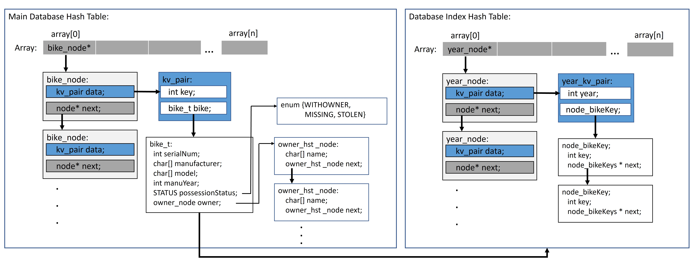
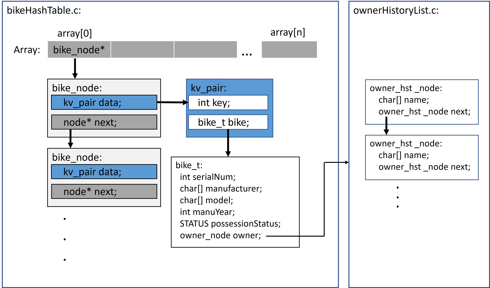
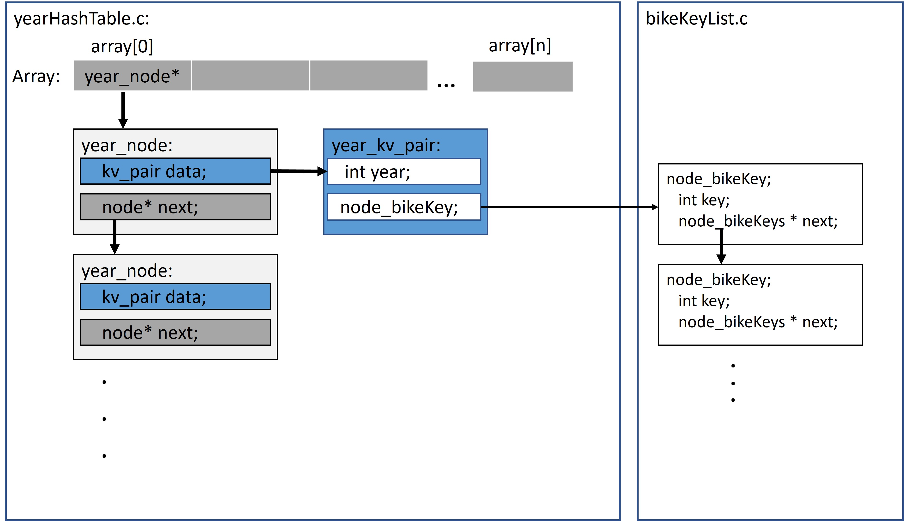

# The Bicycle Database User Manual

## Background

The Bicycle Database is a system for storing the records of your bicycle and anybody else's. This not only gives us a way to register and keep track of our bikes, but also to help any recovery if they're ever stolen.

The program supprots simple offline saving and fast lookup via indexing. In this manual, we go through a few key operations of the system.

## User Facing Operations

### Finding a bike with a Serial Number

To look up a bicycle, the bicycle must already be in the database, and we must first know the serial number of the bicycle. This is because each bike has a unique serial number associated with its frame. Once we have the serial number, we can access the record.

1. From the main menu, input `1`.
2. Input the serial number of the bike.
3. The entire record will be printed.

### Finding a bike with the manufactured year

We might want to quickly access biked that we do not have the serial number for, in these cases we can find bikes based on their manufactured year. Doing so is similar to finding a bike with it's serial number:

1. From the main menu, input `2`.
2. Input the year of the bike.
3. All records with that year will be shown.

### Adding your bike

1. From the main menu, input `3`.
2. Input the information of the bike based on the prompts.

### Editing your bike

1. From the main menu, input `4`.
2. Enter the serial number of the bike to be edited
3. Select the field to be edited.
4. Enter your new desired value.

### Changing the owner of your bike

1. From the main menu, input `4`.
2. Enter the serial number of the bike to be edited
3. Select the owner field with `5`.
4. Enter your new desired value.

### Deleting your bike

1. From the main menu, input `5`.
2. Enter the serial number of the bike to be deleted.

### Adding multiple bikes with a file

To import bikes from a file, ensure that a file is first created. See the below section of the file system for more information on how to create one.

1. From the main menu, input `6`.
2. Enter the file to import from.

### Exporting a bike to your file

1. From the main menu, input `7`.
2. Enter the serial number of the bike to write to a file.
3. Specify the file name to save to. If a file with that name already exists, it will be overwritten.
4. Find the file in the same directory as the program.

### Quit the Program

Note: It is important to quit the program safely with this method, otherwise data loss might occur.

1. From the main menu, input `8`

## Miscellaneous/Diagnostic Operations

The diagnostic operations are meant to provide additional functionality to those who are curious. They aren't considered core to a database user but are nonetheless useful.

### Printing all entries

This function will print the entire database and might result in a very big output.

1. From the main menu, input `9`.

### Printing the database index

Currently, the database is indexed by the manufacturing year. To see how this indexing table, use this function

1. From the main menu, input `10`.

### Compute a hashkey

The database uses a hash table to store the bike records. To run the hash function used, use this function. This does not affect the database in anyway.

1. From the main menu, input `11`.
2. Enter a serial number.
3. The program would give the hash result of that serial number.

### Exporting the database

If you wish to write the entire database to a file of your own, this function will do so. Writing to a .txt file is recommended

1. From the main menu, input `12`.
2. Entire the file name
3. The file will be saved in the same directory as the program.

### Saving the database

While the database usually saves when closed, this option will save the database as it is to the disc.

1. From the main menu, input `13`.
2. The database will be saved to its default location.

## Compiling and Running

The main driver to launch the database program is found in `bikeDatabaseMenu.c`. The program also requires the following files to run:

```
bikeHashTable.c
bikeHashTable.h
bikeKeyList.c
ownerHistoryList.c
ownerHistoryList.h
yearHashTable.c
yearHashTable.h
```

To run the database would require compiling and running the compiled program. The following is one example of compiling and running on a Linux machine.

1. Ensure all files are in the same directory.
2. Open the command prompt to the directory.
3. Compile with `gcc bikeDatabaseMenu.c -o bikedatabase.c`.
4. Run with `./bikedatabase.out`.

# Database Record Files
The database uses `.txt` files to represent records of the bicycle entries. These files have two functions:

1. Save the entries onto disc, but also to load a previous state after the program is terminated and started again.
2. Allow users to export and import entries with their own files.

Presently, the entire database information is stored when the program is terminated, or when manually done so by a user. Upon restart, the program will load any stored data.

Users can also import or export any entries through the menu by preparing their own files with the right format. The following is illustrate that format:
```
{SERIAL NUMBER} {MANUFACTURER} {MODEL NAME} {YEAR MANUFACTURED} {STATUS} {OWNER-LIST}
```
`{SERIAL NUMBER}` - The serial number of the bicycle, numbers only\
`{MANUFACTURER}` - The manufacturer of the bicycle\
`{MODLE NAME}` - The model name of the bicycle\
`{YEAR MANUFACTURED}` - The 4 digit year manufactured year, numbers only\
`{STATS}` - The possession status of the bike, 0 for with owner, 1 for missing, 2 for stolen\
`{OWNER-LIST}` - The list of owners in reverse chronological order. (Latest owner first). End each owner with a dash `-`.  

An example:
```
9099123 Marin Kentfield 2005 0 Bryan-Lydia-Giz
323473 tokyobike Sport 2022 0 Shah-
```

# System Architecture

The database system is implemented by a hash table, using each bike's serial number as the key. Additionally, another hash table is used to index the manufactured year of each bike to allow for quick lookups. The index table uses the year as a key and a list of serial numbers as the values. Any updates to the main hash table will be reflected in the index table.

Below is a visual representation of the data structures used:


The data structures are decomposed into the following files:
```
bikeHashTable.c
bikeHashTable.h
bikeKeyList.c
ownerHistoryList.c
ownerHistoryList.h
yearHashTable.c
yearHashTable.h
```



# Future Improvements
- Add index tables for other fields, requires hashing functions for each field.
- Improve the way the database is saved as a file, with a custom format.
- Add a mode to run database on disc for large databases.